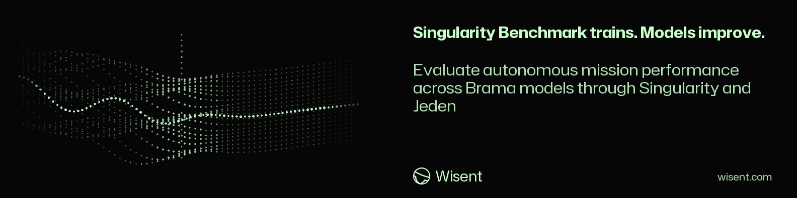

<!-- wisent-banner:start -->
<p align="center">
  
</p>
<!-- wisent-banner:end -->

<!-- wisent-readme-signals:start -->
[](https://github.com/wisent-ai/singularity-benchmark) [](https://github.com/wisent-ai/singularity-benchmark/issues) [](https://wisent.com) [](https://discord.gg/qRjpkthq54) [](https://www.linkedin.com/company/wisent-ai/) [](https://x.com/wisentai) [](https://calendly.com/lbartoszcze)
<!-- wisent-readme-signals:end -->

# Singularity Benchmark

`singularity-benchmark` compares every currently available tool-capable Brama model on the same deterministic external stimulus while Singularity retains its autonomous digital-being contract. Singularity owns the continuous cognition-and-tool loop, Brama owns authenticated model routing, and Las owns federated tool discovery.

## Inputs

- `dataset/benchmark.json` is the versioned evaluation contract.
- Each fixture is copied into an isolated workspace before a model sees it.
- The eligible model set comes from Jeden's signed, caller-scoped Brama catalogue cache after a fresh `jeden doctor --json` catalogue request.
- Only catalogue entries with `available=true` and `tools=true` run unless `--model` selects a smaller set.

## Run

Build Singularity and Jeden first, then launch the runner through Jeden's Skarbiec wrapper so the Brama bearer and request-signing credential stay in memory while each case invokes one Singularity cycle:

```sh
cargo build --release --locked
BRAMA_URL=https://charless-mac-mini.tail6443b3.ts.net:8443 \
JEDEN_BIN=target/release/singularity-benchmark \
/usr/bin/env bash ../jeden/scripts/run-with-stado.sh \
  --singularity ../singularity/target/release/singularity \
  --output results \
  --jobs 4
```

Use `--jobs` to bound concurrent provider families; models sharing a provider prefix remain sequential so bounded subscription capacity cannot bias their verdicts. Each model also remains sequential across its cases. Use repeated `--model provider/model` arguments for a bounded comparison. `BRAMA_URL` must name the TLS service port; the host's unqualified HTTPS endpoint is a different protected surface.

## Scoring

Every case combines:

- deterministic file or structural JSON graders;
- a hard workspace-boundary grader that rejects undeclared paths;
- a completion award only when Singularity reports `completed`;
- hard-failure counts independent of the numeric score.

Verdicts are `qualified`, `strong`, `partial`, or `refused`. Ranking sorts by score, hard failures, completed cases, latency, then model id. Latency breaks otherwise equal scores and is not folded into correctness.

The runner writes each completed model to `results/<timestamp>/<model>/result.json`, then assembles the run's `report.json`, leaderboard, and atomic `results/latest.json` and `results/LEADERBOARD.md` pointers. Raw workspaces remain local and are ignored by Git; reports can include bounded runtime errors but never bearer or request-signing values. The latest complete recorded comparison is published at `results/final-v1-2-qualified/latest.json`, with its compact ranking at `results/final-v1-2-qualified/LEADERBOARD.md`.

## Boundaries

The benchmark does not invoke arbitrary child tools. The Las case inspects the configured federated catalogue and records its surfaces without calling a child tool. Provider availability and subscription health remain Brama concerns; a routing refusal is recorded as a refused evaluation rather than credited as task behavior.
